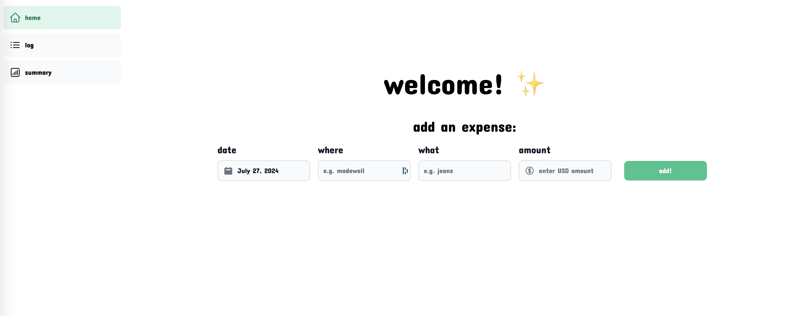

# 💸 sage-ui

Sage is a personal spending tracker that helps you visualize where your money is going. Sage-UI is a frontend client written with Next.js, designed to be used with its backend component, [sage](https://github.com/stephkyou/sage). 

## Installation & Usage

Make sure you have [npm](https://www.npmjs.com/) installed on your computer and clone this repo. Within your downloaded directory, run `npm run dev` to get sage-ui running. Navigate to [http://localhost:3000](http://localhost:3000) (or the provided url in the output) to see Sage in action!

